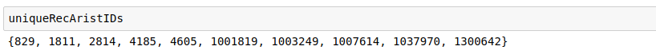

# CollaborativeFiltering
- Successful addition of step

- Results from the logs generated by AWS EMR

- For results generated by execution on cloudera VM, see the jupyter notebook as well

**(The ids of the recommended arrtists are same as given in the book. The ids of the recommended artists in the book are: 1300642, 2814, 1037970, 1001819, 4605)**
